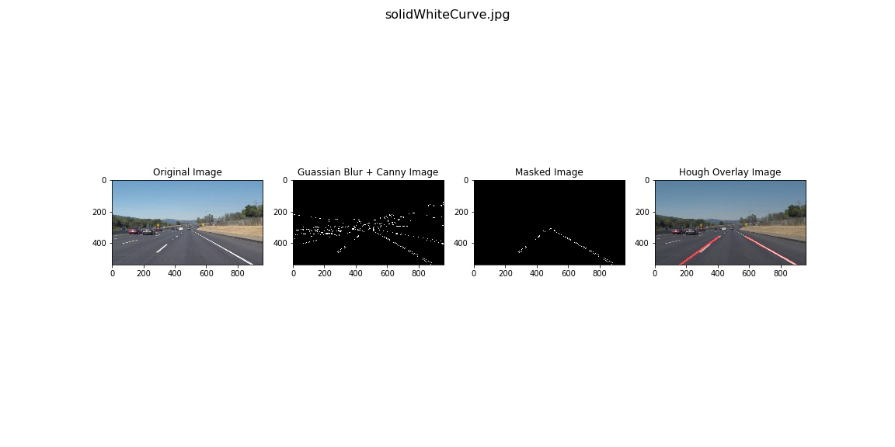

# **Finding Lane Lines on the Road** 

## Writeup Template

---

**Finding Lane Lines on the Road**

The goals / steps of this project are the following:
* Make a pipeline that finds lane lines on the road
* Reflect on your work in a written report

---

### Reflection

### 1. My Pipeline

My pipeline consisted of 5 steps. 
    1. I converted the images to grayscale
    2. I applied Guassian Blur
    3. I applied Canny Edge Detector
    4. I then created a mask to look at bottom center of the images
    5. Finally I used Hough's transform to draw edges
      
In order to draw a single line on the left and right lanes, I modified the draw_lines() function by doing the following
    1. Found the slope m of the edges.
    2. Split the edges into two groups, left or right based on the m. The groups are lists that contains list of slope, y-intercept, and length of the edges.
    3. Find the averages for slope and y intercept based on distance of the edges 

If you'd like to include images to show how the pipeline works, here is how to include an image: 

### 2. Identify potential shortcomings with your current pipeline

One potential shortcoming would be what would happen when the lane lines are dashed lines and not solid. This causes for any outliers that may have been detected to have a huge impact on the draw_lines() function. 

Another shortcoming could be that this pipeline is very fined tuned for specific images. As seen in the challenge, when faced with variety of environment factors such as lighting, shades, and etc, the algorithm fails to detect lane lines.

### 3. Suggest po ssible improvements to your pipeline

A possible improvement would be to look for more stringent slope value of edges to process. 

